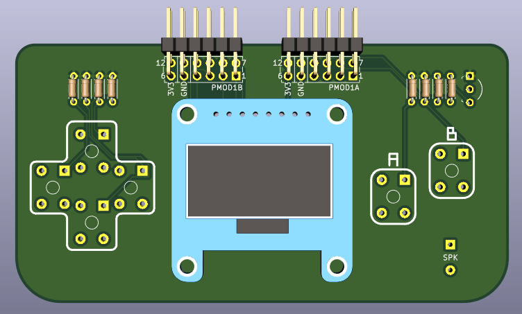

# Arduboy PMOD

A simple dual PMOD connector board using thru-hole components on a 2-layer PCB. It was designed for playing the Arduboy on the [iCEBreaker FPGA Board](https://1bitsquared.com/products/icebreaker), but is generic enough for other creative purposes.

# Hardware Specifications

* Adafruit monochrome [1.3" 128x64 OLED](https://www.adafruit.com/product/938).
* Six 6x6mm Tactile switches. I prefer feel of the [B3F-1020](https://www.digikey.com/product-detail/en/omron-electronics-inc-emc-div/B3F-1020/SW402-ND/44059) with 100gf actuation. 10K pull down resistors for each button.
* Small Piezo speaker (like [this one](https://www.digikey.com/product-detail/en/tdk-corporation/PS1240P02CT3/445-5229-1-ND/2179635) or [this](https://www.digikey.com/product-detail/en/murata-electronics/PKM13EPYH4000-A0/490-4698-1-ND/1219329)). A [C1815 transistor](https://www.digikey.com/product-detail/en/on-semiconductor/KSC1815YTA/KSC1815YTACT-ND/3908203) and two 1K resistors for driving it.
* Generic 100mil 6x2 angled male headers like [these](https://www.digikey.com/product-detail/en/sullins-connector-solutions/PREC006DBAN-M71RC/S2112EC-06-ND/2775648) (12 position, 2 rows), for the PMOD connectors.
* The resistors are 1/8W (the distance between the pads is 200mil), instead of the bigger 1/4W ones. Links: [1K](https://www.digikey.com/product-detail/en/stackpole-electronics-inc/CF18JT1K00/CF18JT1K00CT-ND/2022742), [10K](https://www.digikey.com/product-detail/en/stackpole-electronics-inc/CF18JT10K0/CF18JT10K0CT-ND/2022766).

# Ordering

[v0.1 hosted on OSHPark](https://oshpark.com/shared_projects/jLNBtxrI)
